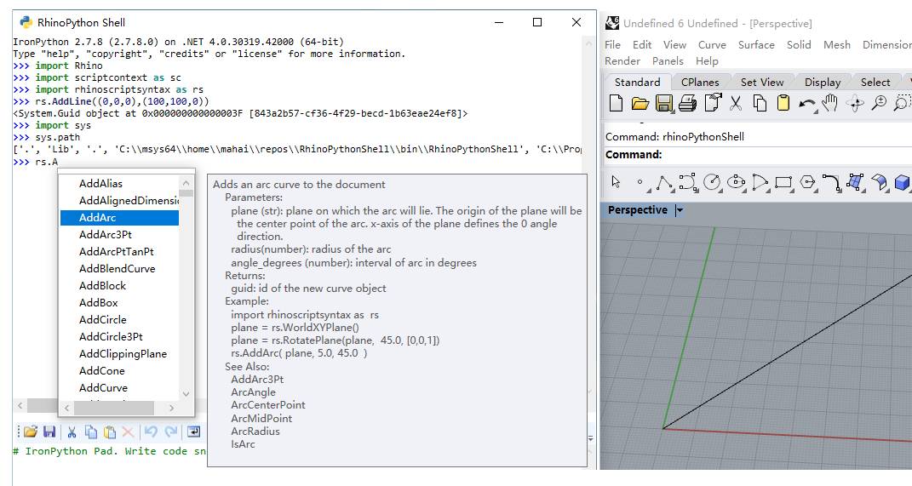

# RhinoPythonShell

The RhinoPythonShell adds an IronPython interpreter to  Rhino3d. 

The RhinoPythonShell lets you to write scripts for Rhino3d in Python. But even better, it provides you with an
interactive shell that lets you see the results of your code *as you type it*. This is great for exploring the [rhinscriptsyntax](https://developer.rhino3d.com/api/RhinoScriptSyntax/), scriptcontext, [RhinoCommon](https://developer.rhino3d.com/api/RhinoCommon/html/R_Project_RhinoCommon.htm) API while 
writing your Rhino.python script. 

inspired by RevitPythonShell.

## Features

- interactive IronPython interpreter for exploring the API
  - with syntax highlighting
  - autocompletion (press CTRL+SPACE after a period)
  - based on the [IronLab](http://code.google.com/p/ironlab/) project
- batteries included! (rhinoscriptsyntax, scriptcontext)
- full access to the .NET framework and the RhinoCommon API

## Installation

1. works for rhino6 and rhino7 wip
1. unzip `RhinoPythonShell.zip` to rhino3d pluginin folder
1. type `RhinoPythonShell`, in rhino command.
1. enjoy it!

## Contribute

- Issue Tracker:  https://github.com/caadxyz/RhinoPythonShell/issues
- Source Code: https://github.com/caadxyz/RhinoPythonShell

## Todo

* cache command history
